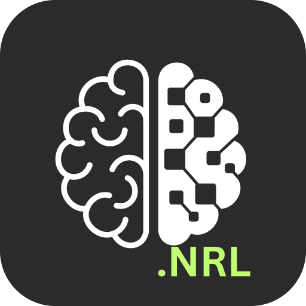

<p align="center">
  
  <h1 align="center">myGenKit</h1>
  <p align="center">Build your own personal assistant with Gemini GenAI! Please join me to add your features!</p>
</p>


Features in my vision:

- [x] Talking Assistant
- [x] Local Settings (with Encyption)
- [x] Conversation Scheduler (with Calendar)
- [ ] Language Learning
- [ ] Meeting Preparation
- [ ] Interview Preparation
- [ ] Todoist
- [ ] Weekly Planner
- [ ] Deep Researcher
- [ ] Canvas

## Usage

Install and start server:

```
npm install && npm start
```

Access server at <http://localhost:3000>. [Create a free Gemini API key](https://aistudio.google.com/apikey) and enter on web UI to use.

## Plugins

myGenKit features a powerful plugin system that allows you to extend the AI assistant with custom applications, tools, and UI components. Each plugin runs in its own tab and can integrate deeply with the AI conversation system.

### Current Plugins

#### Language Learning Plugin
A comprehensive language learning assistant that helps users build vocabulary with AI integration. Features include:
- **Vocabulary Management**: Add, edit, and organize words with translations, definitions, and examples
- **AI Integration**: The AI can automatically add suggested words to your vocabulary
- **Progress Tracking**: Track mastery levels and review counts
- **Multi-language Support**: Support for 10+ languages (Spanish, French, German, Japanese, etc.)
- **Spaced Repetition**: Smart review system for optimal learning

**AI Tools:** `add_word`, `remove_word`, `query_words`

### Creating Your Own Plugin

#### 1. Plugin Structure
Create a new directory in `src/plugins/` with the following structure:

```
src/plugins/your-plugin-name/
├── index.ts              # Plugin definition and registration
├── YourPluginApp.tsx     # Main React component
└── README.md             # Plugin documentation
```

#### 2. Plugin Definition
Create an `index.ts` file that exports your plugin definition:

```typescript
import { PluginDefinition } from '../../types';
import { YourPluginApp } from './YourPluginApp';

export const yourPlugin: PluginDefinition = {
  id: 'your-plugin-id',
  name: 'Your Plugin Name',
  description: 'What your plugin does',
  version: '1.0.0',
  author: 'Your Name',
  
  // React component for the plugin tab
  tabComponent: YourPluginApp,
  
  // Optional: System prompt for AI conversations
  systemPrompt: 'You are a helpful assistant for...',
  
  // Optional: AI tools your plugin provides
  tools: [
    {
      declaration: yourToolDeclaration,
      handler: yourToolHandler
    }
  ]
};
```

#### 3. Plugin Component
Create a React component that implements your plugin UI:

```typescript
import React from 'react';
import { PluginContext } from '../../types';

interface YourPluginAppProps {
  isActive: boolean;
  context?: PluginContext;
}

export const YourPluginApp: React.FC<YourPluginAppProps> = ({ isActive, context }) => {
  if (!isActive) return null;
  
  return (
    <div className="h-full p-4">
      <h2 className="text-xl font-bold mb-4">Your Plugin</h2>
      {/* Your plugin UI here */}
    </div>
  );
};
```

#### 4. Plugin Context & Storage
Your plugin receives a context object with access to:

```typescript
interface PluginContext {
  storage: {
    get(key: string): Promise<any>;
    set(key: string, value: any): Promise<void>;
    remove(key: string): Promise<void>;
    clear(): Promise<void>;
  };
  userId: string;
  addMessage: (message: any) => Promise<void>;
  createConversation: (systemPrompt?: string) => Promise<void>;
  currentConversation: Conversation | null;
}
```

#### 5. AI Tool Integration
Define tools that the AI can call to interact with your plugin:

```typescript
import { FunctionDeclaration, Type } from '@google/genai';

const yourTool: FunctionDeclaration = {
  name: 'your_function',
  description: 'What this function does',
  parameters: {
    type: Type.OBJECT,
    properties: {
      param1: {
        type: Type.STRING,
        description: 'Parameter description'
      }
    },
    required: ['param1']
  }
};

const handleYourTool = async (args: any, context: PluginContext) => {
  try {
    // Process the tool call
    const result = await processYourData(args.param1);
    
    return {
      success: true,
      data: result
    };
  } catch (error) {
    return {
      success: false,
      error: error.message
    };
  }
};
```

#### 6. Register Your Plugin
Add your plugin to the application by importing and registering it in the main plugin registry.

### Plugin Features

- **Isolated Storage**: Each plugin gets its own encrypted storage per user
- **AI Integration**: Define custom tools that the AI can call during conversations
- **Tab UI**: Automatic integration with the sidebar tab system
- **Conversation Tagging**: Plugin conversations are automatically tagged and filtered
- **Lifecycle Management**: Optional initialize and cleanup methods
- **Error Handling**: Built-in error handling and plugin isolation

### Best Practices

1. **Storage Management**: Use descriptive keys and handle errors gracefully
2. **UI Responsiveness**: Design for the sidebar layout with proper responsive behavior
3. **Error Handling**: Always provide meaningful error messages in tool handlers
4. **Performance**: Use React optimization techniques (`useMemo`, `useCallback`)
5. **User Experience**: Provide loading states and clear feedback
6. **Documentation**: Document your plugin's features and API

### Plugin Ideas

Here are some plugin ideas you can implement:
- **Todoist Integration**: Task management with AI assistance
- **Meeting Preparation**: Research and agenda building
- **Interview Prep**: Practice questions and feedback
- **Weekly Planner**: Schedule optimization and planning
- **Deep Researcher**: Multi-source research compilation
- **Canvas**: Visual diagram and flowchart creation

For detailed plugin development documentation, see `src/plugins/README.md`.

## References

This project was initialized from example app of Google at [google-gemini/live-api-web-console](https://github.com/google-gemini/live-api-web-console).

