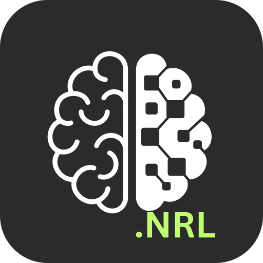

</img>

# myGenKit

Build your own personal assistant with rich feature with GenAI! Please join me to add your features!

Features in my vision:

- [x] Talking Assistant
- [x] Local Settings
- [ ] Language Learning
- [ ] Todoist
- [ ] Weekly Planner
- [ ] Deep Researcher
- [ ] Canvas
- [ ] Connect with Calendar

## Usage

Install and start server:

```
npm install && npm start
```

Access server at <http://localhost:3000>. [Create a free Gemini API key](https://aistudio.google.com/apikey) and enter on web UI to use.

## References

This project was initialized from example app of Google at [google-gemini/live-api-web-console](https://github.com/google-gemini/live-api-web-console).

